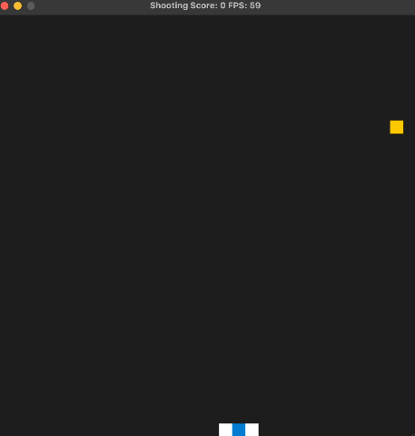

# CPPND: Capstone Project

## Overview: Shooting Game in C++ with SDL

This is repo for the Capstone project in the [Udacity C++ Nanodegree Program](https://www.udacity.com/course/c-plus-plus-nanodegree--nd213). The code for this repo was inspired by [this](https://github.com/udacity/CppND-Capstone-Snake-Game) repo and implemented into another game which is Shooting Game.

The Shooting Game is implemented with SDL library. Once you enter the game window, you can use the keyboard to control the plane body and launch the bullet to get the scores. Also, the game will become harder if you get enough points from the targets. 

## File Structure

This repo contains:

* `include/`: Contains the header files `controller.h`, `game.h`, `renderer.h`, `shootingPlane.h`, `targetObj.h`.
  * `controller.h`: The class `Controller` handles the keyboard input and transfer the direction information.
  * `game.h`: The class `Game` runs the shooting game and updates `ShootingPlane`, `TargetObj` and `Renderer` information.
  * `renderer.h`: The class `Renderer` illustrates the grid with specific color.
  * `shootingPlane.h`: The class `ShootingPlane` updates position of the plane.
  * `targetObj.h`: The class `TargetObj` initializes the grid object with specific position and speed which will be used into `Game` and `ShootingPlane`.
* `src/`: Contains the Source files `controller.cpp`, `game.cpp`, `renderer.cpp`, `shootingPlane.cpp`, `targetObj.cpp`.
* `CMakeLists.txt`: cmake configuration file.
* `README.md`: Description of this project (This file).

## Dependencies for Running Locally
* cmake >= 3.7
  * All OSes: [click here for installation instructions](https://cmake.org/install/)
* make >= 4.1 (Linux, Mac), 3.81 (Windows)
  * Linux: make is installed by default on most Linux distros
  * Mac: [install Xcode command line tools to get make](https://developer.apple.com/xcode/features/)
  * Windows: [Click here for installation instructions](http://gnuwin32.sourceforge.net/packages/make.htm)
* SDL2 >= 2.0
  * All installation instructions can be found [here](https://wiki.libsdl.org/Installation)
  >Note that for Linux, an `apt` or `apt-get` installation is preferred to building from source. 
* gcc/g++ >= 5.4
  * Linux: gcc / g++ is installed by default on most Linux distros
  * Mac: same deal as make - [install Xcode command line tools](https://developer.apple.com/xcode/features/)
  * Windows: recommend using [MinGW](http://www.mingw.org/)

## Basic Build and Run Instructions

1. Clone this repo using `git clone https://github.com/PofuWu/CppND-Program-Capstone-Project`
2. Enter the root directory using `cd CppND-Program-Capstone-Project`
3. Make a build directory in the top level directory: `mkdir build && cd build`
4. Compile: `cmake .. && make`
5. Run it: `./ShootingGame`.

  
## Rubric
* README
  * A README with instructions is included with the project.
  * The README indicates which project is chosen.
  * The README includes information about each rubric point addressed.
* Compiling and Testing
  * The submission must compile and run.
* Loops, Functions, I/O
  * The project demonstrates an understanding of C++ functions and control structures.
  * The project accepts user input and processes the input.
* Object Oriented Programming
  * The project uses Object Oriented Programming techniques.
  * Classes use appropriate access specifiers for class members.
  * Class constructors utilize member initialization lists.
  * Classes abstract implementation details from their interfaces.
  * Classes encapsulate behavior.
* Memory Management
  * The project makes use of references in function declarations.
  * The project uses destructors appropriately.
* Concurrency
  * None

